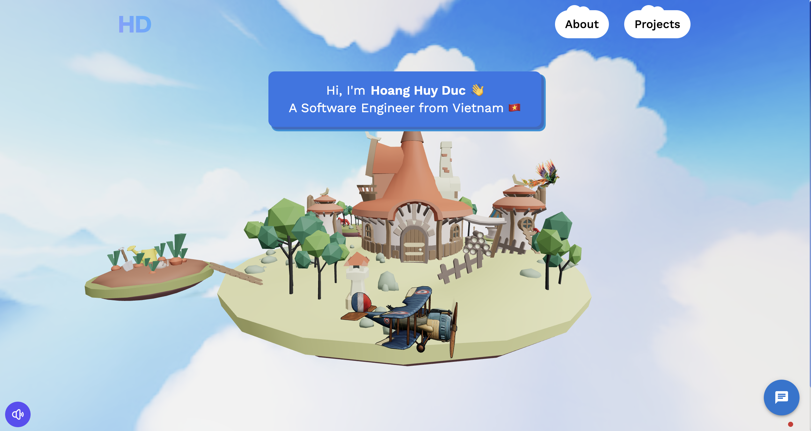

# Hoang Huy Duc Portfolio

A modern portfolio website built with React and Three.js, featuring 3D animations, interactive components, and a clean design.



## Features

- 🎨 Modern and clean UI design
- 🎮 Interactive 3D elements using Three.js
- 📱 Fully responsive layout
- 🌍 Multi-language support (English/Vietnamese)
- 📧 Contact form integration with EmailJS
- 📊 Google Sheets integration for data management
- 🔒 Secure authentication with Google OAuth2
- 💬 Chat functionality with OpenAI integration

## Tech Stack

- React.js
- Three.js
- Material-UI
- TailwindCSS
- EmailJS
- Google Sheets API
- OpenAI API
- Hugging Face API

## Prerequisites

Before you begin, ensure you have the following installed:
- Node.js (v18 or higher)
- npm or yarn
- Git

## Installation

1. Clone the repository:
```bash
git clone https://github.com/huyduc1602/hoanghuyduc.com.git
cd hoanghuyduc
```

2. Install dependencies:
```bash
npm install
```

3. Create `.env` file by copying from `.env.example`:
```bash
cp .env.example .env
```

4. Update the `.env` file with your environment variables:
```env
VITE_APP_EMAILJS_SERVICE_ID=your_service_id
VITE_APP_EMAILJS_TEMPLATE_ID=your_template_id
VITE_APP_EMAILJS_PUBLIC_KEY=your_public_key
# Update other required environment variables
```

5. Start the development server:
```bash
npm run dev
```

## Project Structure

```
hoanghuyduc/
├── public/
├── src/
│   ├── assets/
│   ├── components/
│   ├── constants/
│   ├── contexts/
│   ├── hooks/
│   ├── pages/
│   └── App.jsx
├── .env
├── .gitignore
├── package.json
└── vite.config.js
```

## Available Scripts

- `npm run dev` - Start development server
- `npm run build` - Build for production
- `npm run preview` - Preview production build
- `npm run lint` - Run ESLint
- `npm run dev:all` - Run both frontend and backend servers

## Contributing

1. Fork the repository
2. Create your feature branch (`git checkout -b feature/AmazingFeature`)
3. Commit your changes (`git commit -m 'Add some AmazingFeature'`)
4. Push to the branch (`git push origin feature/AmazingFeature`)
5. Open a Pull Request

## License

This project is licensed under the MIT License - see the [LICENSE](LICENSE) file for details.

## Contact

Hoang Huy Duc - [@linkedin](https://www.linkedin.com/in/hoanghuyduc/)

Project Link: [https://github.com/huyduc1602/hoanghuyduc.com](https://github.com/huyduc1602/hoanghuyduc.com)

## Acknowledgments

- [Three.js](https://threejs.org/)
- [React Three Fiber](https://docs.pmnd.rs/react-three-fiber)
- [Material-UI](https://mui.com/)
- [EmailJS](https://www.emailjs.com/)
- [Google Sheets API](https://developers.google.com/sheets/api)
- [OpenAI API](https://openai.com/api/)

